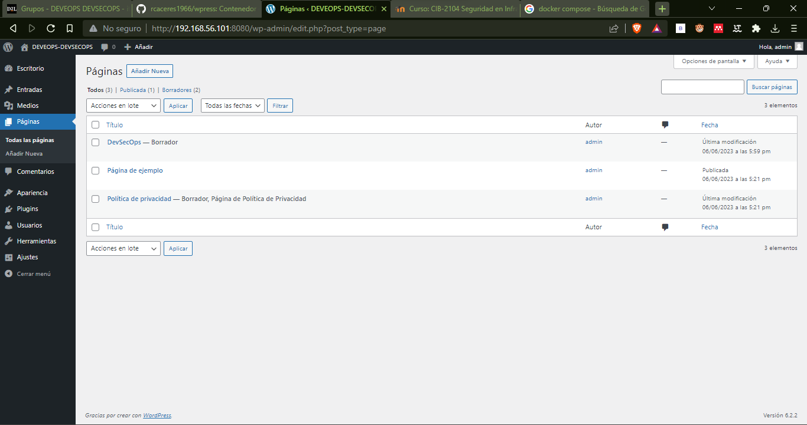

# Docker-Compose-Wordpress

Para poder crear el archivo docker-compose.yml accedemos a la sigueinte liga y copiar el eejmplo del archivo con extensión .yml e la sigueinte liga: https://hub.docker.com/_/wordpress

Se mantiene la configuración del docker-compose.yml 

    version: '3.1'

    services:

    wordpress:
        image: wordpress
        restart: always
        ports:
        - 8080:80
        environment:
        WORDPRESS_DB_HOST: db
        WORDPRESS_DB_USER: exampleuser
        WORDPRESS_DB_PASSWORD: examplepass
        WORDPRESS_DB_NAME: exampledb
        volumes:
        - wordpress:/var/www/html

    db:
        image: mysql:5.7
        restart: always
        environment:
        MYSQL_DATABASE: exampledb
        MYSQL_USER: exampleuser
        MYSQL_PASSWORD: examplepass
        MYSQL_RANDOM_ROOT_PASSWORD: '1'
        volumes:
        - db:/var/lib/mysql

    volumes:
    wordpress:
    db:

## Correr localmente usando docker

Clonar el repositorio al directorio local de instalación

    git clone git@github.com:gasparsulub/Docker-Compose-WordPress.git

Para correr los contenedores se debe acceder a la carpeta donde se encuentra el archivo docker-compose.yml

    $cd Docker-Compose-WordPress

    $docker compose up -d

Para detener los contenedores

    $docker compose down

## Correr WordPress y Configurar

Acceder al navegador con la direccion que tiene la maquina virtual, seguido el puerto a cual ha sido alojado el contenedor

    http://localhost:8080/

    Username: admin

    Password: Pokemon-123456

    Confirm Password checked

    Presionar el boton instalar

## Acceder a WordPress con el usuario y contraseña que se creo previamente

    Username: admin

    Password: Pokemon-123456

## Seleccionar Menu Pluggins

Seleccionar opciones de plugins 

## Agregar Pluggins

Agregar Pluggin Guttentor

Seleccionar Guttentor pluggin e instalarlo, si no se encuentra puede descargarlo en la siguiente liga

    https://es.wordpress.org/plugins/gutentor/

Agregar Pluggin Classic Editor

Seleccionar el boton activar

# Agregar un Tema

Seleccionar en el menu "Apariencia"

Seleccionar un tema

Agregarlo  

Al igual puedes ir a la seccion paginas y crear una seccion desde cero

## Ejemplo de una pagina sencilla

# Importar una Pagina

    Seleccionar herramientas

    Seleccionar importar "import"

    Generar el archivo .xml